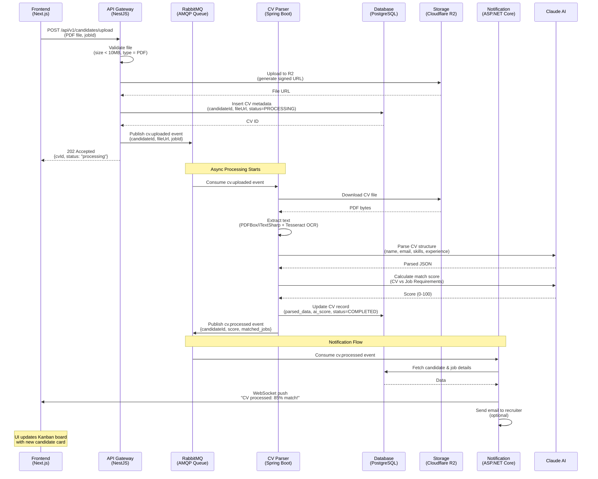

# API Reference

**Project:** TalentFlow AI Backend
**Base URL (Development):** `http://localhost:3000/api/v1`
**Base URL (Production):** `https://api.talentflow.ai/api/v1`
**API Version:** v1
**Architecture:** Service 1 (API Gateway - NestJS) exposes all REST endpoints

**Note:** The endpoints `/health`, `/ready`, and `/metrics` are exposed at the root path (no version prefix), e.g. `/health`, `/ready`, `/metrics`.
**Last Updated:** 2026-02-02

---

## Table of Contents

- [Authentication](#authentication)
- [Users](#users)
- [Jobs](#jobs)
- [Candidates](#candidates)
- [Applications](#applications)
- [Sequence Diagrams](#sequence-diagrams)
- [Error Handling](#error-handling)
- [Rate Limiting](#rate-limiting)

---

## Sequence Diagrams

### CV Upload & Processing Flow



**Flow Steps:**
1. **Upload (Sync):** Frontend uploads CV → API Gateway validates → Store in R2 → Queue event
2. **Processing (Async):** CV Parser consumes event → Parse PDF → Call AI → Update DB
3. **Notification (Async):** Notification service consumes event → WebSocket to Frontend → Email to recruiter

---

## Quick Start

### Base URL
```
Development: http://localhost:3000/api/v1
Production:  https://api.talentflow.ai/api/v1
```

### Authentication
All endpoints (except `/auth/login` and `/auth/signup`) require valid JWT tokens stored in **HttpOnly Cookies**.
The browser automatically sends these cookies with cross-origin credentials enabled (`credentials: 'include'`).

```http
GET /api/v1/jobs
Cookie: access_token=...; refresh_token=...
```

### Response Format

**Success:**
```json
{
  "status": 200,
  "message": "Success",
  "data": { ... },
  "timestamp": "2026-02-01T10:00:00Z"
}
```

**Error:**
```json
{
  "status": 400,
  "error": "Bad Request",
  "message": "Validation failed",
  "details": ["title must be at least 3 characters"],
  "timestamp": "2026-02-01T10:00:00Z"
}
```

---

## Authentication

### POST /auth/signup
Register a new user

**Request:**
```http
POST /api/v1/auth/signup
Content-Type: application/json

{
  "email": "recruiter@company.com",
  "password": "SecurePassword123!",
  "fullName": "Jane Doe",
  "role": "RECRUITER"
}
```

**Response** (201):
```json
{
  "status": 201,
  "message": "User registered successfully",
  "data": {
    "user": {
      "id": "550e8400-e29b-41d4-a716-446655440000",
      "email": "recruiter@company.com",
      "fullName": "Jane Doe",
      "role": "RECRUITER"
    }
  }
}
```

---

### POST /auth/login
Login existing user. Returns `access_token` and `refresh_token` in HttpOnly cookies.

**Request:**
```http
POST /api/v1/auth/login
Content-Type: application/json

{
  "email": "recruiter@company.com",
  "password": "SecurePassword123!"
}
```

**Response** (200):
```json
{
  "status": 200,
  "message": "Login successful",
  "data": {
    "user": {
      "id": "550e8400-e29b-41d4-a716-446655440000",
      "email": "recruiter@company.com",
      "fullName": "Jane Doe",
      "role": "RECRUITER"
    }
  }
}
```

---

### POST /auth/refresh
Refresh access token using `refresh_token` cookie.

**Request:**
```http
POST /api/v1/auth/refresh
Cookie: refresh_token=...
```

**Response** (200):
```json
{
  "status": 200,
  "message": "Token refreshed successfully",
  "data": null
}
```

---

### GET /auth/me
Get current user profile

**Request:**
```http
GET /api/v1/auth/me
Cookie: access_token=...
```

**Response** (200):
```json
{
  "status": 200,
  "data": {
    "id": "550e8400-e29b-41d4-a716-446655440000",
    "email": "recruiter@company.com",
    "fullName": "Jane Doe",
    "role": "RECRUITER",
    "createdAt": "2026-01-15T08:30:00Z"
  }
}
```

---

## Jobs

### GET /jobs
Get all jobs (with filters)

**Request:**
```http
GET /api/v1/jobs?status=OPEN&page=1&limit=20
Authorization: Bearer <access_token>
```

**Query Parameters:**
| Parameter | Type | Description |
|-----------|------|-------------|
| `status` | string | Filter by status: `DRAFT`, `OPEN`, `CLOSED` |
| `page` | number | Page number (default: 1) |
| `limit` | number | Items per page (default: 20, max: 100) |
| `search` | string | Search in title and description |
| `salaryMin` | number | Filter by minimum salary |
| `salaryMax` | number | Filter by maximum salary |
| `skills` | string | Filter by required skills (comma-separated values) |
| `employmentType` | string | Filter by employment type: `FULL_TIME`, `PART_TIME`, `CONTRACT`, `INTERNSHIP` |
| `department` | string | Filter by department |
| `sortBy` | string | Sort by field: `createdAt`, `title`, `salaryMin` (default: `createdAt`) |
| `sortOrder` | string | Sort order: `asc`, `desc` (default: `desc`) |

**Response** (200):
```json
{
  "status": 200,
  "data": {
    "jobs": [
      {
        "id": "550e8400-e29b-41d4-a716-446655440001",
        "title": "Senior Full-Stack Developer",
        "description": "We are looking for...",
        "salaryRange": "$100k - $150k",
        "status": "OPEN",
        "createdAt": "2026-02-01T10:00:00Z",
        "createdBy": {
          "id": "550e8400-e29b-41d4-a716-446655440000",
          "fullName": "Jane Doe"
        },
        "applicationCount": 15
      }
    ],
    "pagination": {
      "page": 1,
      "limit": 20,
      "total": 45,
      "totalPages": 3
    }
  }
}
```

---

### GET /jobs/:id
Get job by ID

**Request:**
```http
GET /api/v1/jobs/550e8400-e29b-41d4-a716-446655440001
Authorization: Bearer <access_token>
```

**Response** (200):
```json
{
  "status": 200,
  "data": {
    "id": "550e8400-e29b-41d4-a716-446655440001",
    "title": "Senior Full-Stack Developer",
    "description": "Full description...",
    "requirements": {
      "skills": ["NestJS", "Next.js", "PostgreSQL"],
      "experience": "5+ years"
    },
    "salaryRange": "$100k - $150k",
    "status": "OPEN",
    "createdAt": "2026-02-01T10:00:00Z",
    "updatedAt": "2026-02-01T10:00:00Z",
    "createdBy": {
      "id": "550e8400-e29b-41d4-a716-446655440000",
      "email": "recruiter@company.com",
      "fullName": "Jane Doe"
    },
    "applications": [
      {
        "id": "app-id-1",
        "stage": "INTERVIEW",
        "candidate": {
          "fullName": "John Doe"
        }
      }
    ]
  }
}
```

---

### POST /jobs
Create a new job

**Request:**
```http
POST /api/v1/jobs
Authorization: Bearer <access_token>
Content-Type: application/json

{
  "title": "Senior Backend Developer",
  "description": "We are looking for an experienced backend developer...",
  "requirements": {
    "skills": ["NestJS", "PostgreSQL", "Spring Boot", "RabbitMQ"],
    "experience": "5+ years"
  },
  "salaryRange": "$120k - $160k",
  "status": "DRAFT"
}
```

**Response** (201):
```json
{
  "status": 201,
  "message": "Job created successfully",
  "data": {
    "id": "550e8400-e29b-41d4-a716-446655440002",
    "title": "Senior Backend Developer",
    "status": "DRAFT",
    "createdAt": "2026-02-01T11:00:00Z"
  }
}
```

---

### PATCH /jobs/:id
Update job

**Request:**
```http
PATCH /api/v1/jobs/550e8400-e29b-41d4-a716-446655440001
Authorization: Bearer <access_token>
Content-Type: application/json

{
  "status": "OPEN"
}
```

**Response** (200):
```json
{
  "status": 200,
  "message": "Job updated successfully",
  "data": {
    "id": "550e8400-e29b-41d4-a716-446655440001",
    "status": "OPEN",
    "updatedAt": "2026-02-01T11:30:00Z"
  }
}
```

---

### DELETE /jobs/:id
Delete job

**Request:**
```http
DELETE /api/v1/jobs/550e8400-e29b-41d4-a716-446655440001
Authorization: Bearer <access_token>
```

**Response** (200):
```json
{
  "status": 200,
  "message": "Job deleted successfully"
}
```

---

## Candidates

### POST /candidates/upload
Upload CV and create candidate

**Request:**
```http
POST /api/v1/candidates/upload
Authorization: Bearer <access_token>
Content-Type: multipart/form-data

------WebKitFormBoundary
Content-Disposition: form-data; name="file"; filename="john-doe-resume.pdf"
Content-Type: application/pdf

<binary data>
------WebKitFormBoundary
Content-Disposition: form-data; name="email"

john.doe@email.com
------WebKitFormBoundary
Content-Disposition: form-data; name="fullName"

John Doe
------WebKitFormBoundary--
```

**Response** (201):
```json
{
  "status": 201,
  "message": "CV uploaded successfully. Processing started.",
  "data": {
    "candidate": {
      "id": "cand-id-1",
      "email": "john.doe@email.com",
      "fullName": "John Doe",
      "resumeUrl": "https://talentflow-cvs.r2.cloudflarestorage.com/resumes/john-doe-resume.pdf"
    },
    "processing": {
      "status": "QUEUED",
      "message": "CV is being parsed. You will be notified when complete."
    }
  }
}
```

---

### GET /candidates
List all candidates

**Request:**
```http
GET /api/v1/candidates?page=1&limit=20&search=john
Authorization: Bearer <access_token>
```

**Response** (200):
```json
{
  "status": 200,
  "data": {
    "candidates": [
      {
        "id": "cand-id-1",
        "fullName": "John Doe",
        "email": "john.doe@email.com",
        "phone": "+1234567890",
        "resumeUrl": "https://...",
        "createdAt": "2026-02-01T09:00:00Z"
      }
    ],
    "pagination": {
      "page": 1,
      "limit": 20,
      "total": 150,
      "totalPages": 8
    }
  }
}
```

---

## Applications

### POST /applications
Submit application

**Request:**
```http
POST /api/v1/applications
Authorization: Bearer <access_token>
Content-Type: application/json

{
  "jobId": "job-id-1",
  "candidateId": "cand-id-1"
}
```

**Response** (201):
```json
{
  "status": 201,
  "message": "Application submitted successfully",
  "data": {
    "id": "app-id-1",
    "jobId": "job-id-1",
    "candidateId": "cand-id-1",
    "stage": "APPLIED",
    "status": "PENDING",
    "appliedAt": "2026-02-01T12:00:00Z"
  }
}
```

---

### PATCH /applications/:id/stage
Update application stage

**Request:**
```http
PATCH /api/v1/applications/app-id-1/stage
Authorization: Bearer <access_token>
Content-Type: application/json

{
  "stage": "INTERVIEW"
}
```

**Response** (200):
```json
{
  "status": 200,
  "message": "Application stage updated",
  "data": {
    "id": "app-id-1",
    "stage": "INTERVIEW",
    "updatedAt": "2026-02-01T13:00:00Z"
  }
}
```

---

## Error Handling

### HTTP Status Codes

| Code | Meaning |
|------|---------|
| 200 | Success |
| 201 | Created |
| 400 | Bad Request (validation error) |
| 401 | Unauthorized (invalid/missing token) |
| 403 | Forbidden (insufficient permissions) |
| 404 | Not Found |
| 409 | Conflict (duplicate resource) |
| 422 | Unprocessable Entity |
| 429 | Too Many Requests (rate limit) |
| 500 | Internal Server Error |

### Error Response Examples

**Validation Error (400):**
```json
{
  "status": 400,
  "error": "Bad Request",
  "message": "Validation failed",
  "details": [
    "title must be at least 3 characters",
    "email must be a valid email address"
  ],
  "timestamp": "2026-02-01T10:00:00Z"
}
```

**Unauthorized (401):**
```json
{
  "status": 401,
  "error": "Unauthorized",
  "message": "Invalid or expired token",
  "timestamp": "2026-02-01T10:00:00Z"
}
```

**Not Found (404):**
```json
{
  "status": 404,
  "error": "Not Found",
  "message": "Job with ID 'invalid-id' not found",
  "timestamp": "2026-02-01T10:00:00Z"
}
```

---

## Rate Limiting

**Limits:**
- **Anonymous**: 10 requests / minute
- **Authenticated**: 100 requests / minute
- **Admin**: 1000 requests / minute

**Headers:**
```http
X-RateLimit-Limit: 100
X-RateLimit-Remaining: 95
X-RateLimit-Reset: 1672574400
```

**Rate Limit Exceeded (429):**
```json
{
  "status": 429,
  "error": "Too Many Requests",
  "message": "Rate limit exceeded. Try again in 45 seconds.",
  "retryAfter": 45,
  "timestamp": "2026-02-01T10:00:00Z"
}
```

---

## Swagger/OpenAPI

**Interactive API Documentation:**
```
http://localhost:3000/api/docs
```
(Enabled only when `SWAGGER_ENABLED=true`, which defaults to non-production environments.)

**OpenAPI JSON:**
```
http://localhost:3000/api-json
```
(Same availability rules as above.)

---

## WebSocket API (Phase 2)

**Connection:**
```javascript
const socket = io('http://localhost:3000', {
  auth: {
    token: 'your-jwt-token'
  }
});

// Listen for CV processing updates
socket.on('cv:processed', (data) => {
  console.log('CV processed:', data);
});
```

**Events:**
| Event | Description | Payload |
|-------|-------------|---------|
| `cv:processing` | CV parsing started | `{ candidateId, status, progress }` |
| `cv:completed` | CV parsed successfully | `{ candidateId, aiScore, aiSummary }` |
| `cv:failed` | CV parsing failed | `{ candidateId, error }` |
| `application:updated` | Application stage changed | `{ applicationId, stage, status }` |

---

## Related Documentation

- [DATABASE_SCHEMA.md](./DATABASE_SCHEMA.md) - Database design
- [SRS.md](./SRS.md) - Software requirements
- [ADR-006](./adr/ADR-006-hybrid-microservices.md) - Service architecture
- [Swagger Docs](http://localhost:3000/api/docs) - Interactive API explorer

---

**Last Updated:** 2026-02-02
