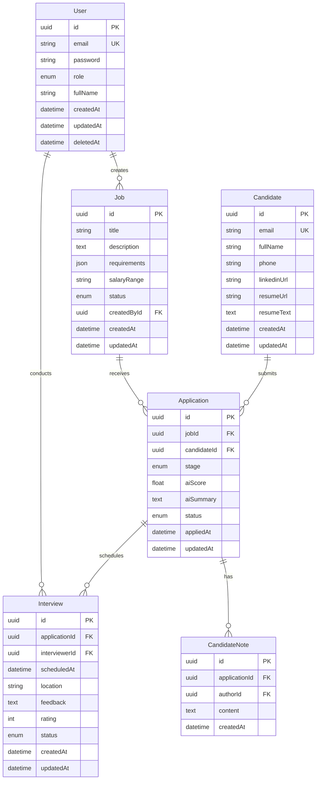

# Database Schema Design

**Project:** TalentFlow AI
**ORM:** Prisma
**Database:** PostgreSQL 16 (Shared by all 3 services)
**Architecture:** Polyglot 3-Service (NestJS + Spring Boot + ASP.NET Core)
**Last Updated:** 2026-02-02

---

## Table of Contents

- [Overview](#overview)
- [Entity Relationship Diagram](#entity-relationship-diagram)
- [Prisma Schema](#prisma-schema)
- [Entities](#entities)
- [Indexes & Performance](#indexes--performance)
- [Migration Strategy](#migration-strategy)

---

## Overview

### Design Principles

1. **Normalization**: Follow 3NF (Third Normal Form) to reduce redundancy
2. **UUID Primary Keys**: Use UUIDs for better security and distribution
3. **Soft Deletes**: Never hard-delete user data (use `deletedAt` field)
4. **Timestamps**: All tables have `createdAt` and `updatedAt`
5. **Snake Case Mapping**: Use snake_case in database, camelCase in TypeScript
6. **Service Ownership**: Logical table ownership for 3-service architecture (see below)

### Core Entities (MVP - Phase 1)

| Entity | Purpose | Service Owner | Status |
|--------|---------|---------------|--------|
| **User** | System users (Admin, Recruiter, Interviewer) | API Gateway | ✅ MVP |
| **Job** | Job postings | API Gateway | ✅ MVP |
| **Candidate** | Job applicants | **CV Parser** | ✅ MVP |
| **Application** | Application submissions | API Gateway | ✅ MVP |
| **Interview** | Interview scheduling | API Gateway | 🔜 Phase 2 |
| **CandidateNote** | Recruiter notes on candidates | API Gateway | 🔜 Phase 2 |
| **AuditLog** | System audit trail | API Gateway | 🔜 Phase 2 |

**Service Ownership Rules:**
- ✅ **API Gateway (NestJS):** Owns `users`, `jobs`, `applications`, `interviews`, `candidate_notes`, `audit_logs`
- ✅ **CV Parser (Spring Boot):** Owns `candidates` table (writes `resume_text`, `ai_score`)
- ✅ **Notification Service (ASP.NET Core):** Stateless (no table ownership, reads from Redis cache)
- ⚠️ **Cross-service reads OK, cross-service writes FORBIDDEN** (except CV Parser updates `candidates`)

---

## Entity Relationship Diagram



---

## Prisma Schema

### Full Schema

**Location Options:**
- **Option 1 (Recommended):** `shared/prisma/schema.prisma` - Shared schema for all services
- **Option 2:** `api-gateway/prisma/schema.prisma` - API Gateway owns Prisma, CV Parser uses JDBC

```prisma
// This is your Prisma schema file
// Learn more: https://pris.ly/d/prisma-schema

generator client {
  provider = "prisma-client-js"
}

datasource db {
  provider = "postgresql"
  url      = env("DATABASE_URL")
}

// ============================================
// ENUMS
// ============================================

enum Role {
  ADMIN
  RECRUITER
  INTERVIEWER
}

enum JobStatus {
  DRAFT
  OPEN
  CLOSED
}

enum ApplicationStage {
  APPLIED
  SCREENING
  INTERVIEW
  OFFER
  HIRED
  REJECTED
}

enum ApplicationStatus {
  PENDING
  IN_REVIEW
  ACCEPTED
  REJECTED
}

enum InterviewStatus {
  SCHEDULED
  COMPLETED
  CANCELLED
  NO_SHOW
}

// ============================================
// MODELS
// ============================================

model User {
  id        String   @id @default(uuid())
  email     String   @unique
  password  String   // bcrypt hashed
  role      Role     @default(RECRUITER)
  fullName  String   @map("full_name")

  createdAt DateTime @default(now()) @map("created_at")
  updatedAt DateTime @updatedAt @map("updated_at")
  deletedAt DateTime? @map("deleted_at") // Soft delete

  // Relations
  createdJobs    Job[]         @relation("JobCreator")
  interviews     Interview[]   @relation("Interviewer")
  notes          CandidateNote[] @relation("NoteAuthor")

  @@map("users")
  @@index([email])
  @@index([role])
}

model Job {
  id          String    @id @default(uuid())
  title       String
  description String    @db.Text
  requirements Json?    // Structured requirements (skills, experience, etc.)
  salaryRange String?   @map("salary_range")
  status      JobStatus @default(DRAFT)

  createdById String    @map("created_by_id")
  createdAt   DateTime  @default(now()) @map("created_at")
  updatedAt   DateTime  @updatedAt @map("updated_at")

  // Relations
  createdBy    User          @relation("JobCreator", fields: [createdById], references: [id])
  applications Application[]

  @@map("jobs")
  @@index([status])
  @@index([createdById])
  @@index([createdAt])
}

model Candidate {
  id          String   @id @default(uuid())
  email       String   @unique
  fullName    String   @map("full_name")
  phone       String?
  linkedinUrl String?  @map("linkedin_url")
  resumeUrl   String   @map("resume_url") // Cloudflare R2 URL
  resumeText  String?  @map("resume_text") @db.Text // Extracted text

  createdAt   DateTime @default(now()) @map("created_at")
  updatedAt   DateTime @updatedAt @map("updated_at")

  // Relations
  applications Application[]

  @@map("candidates")
  @@index([email])
  @@index([fullName])
}

model Application {
  id          String           @id @default(uuid())
  jobId       String           @map("job_id")
  candidateId String           @map("candidate_id")

  stage       ApplicationStage @default(APPLIED)
  status      ApplicationStatus @default(PENDING)
  aiScore     Float?           @map("ai_score") // Phase 2: AI matching score
  aiSummary   String?          @map("ai_summary") @db.Text // Phase 2: AI-generated summary

  appliedAt   DateTime         @default(now()) @map("applied_at")
  updatedAt   DateTime         @updatedAt @map("updated_at")

  // Relations
  job         Job              @relation(fields: [jobId], references: [id])
  candidate   Candidate        @relation(fields: [candidateId], references: [id])
  interviews  Interview[]
  notes       CandidateNote[]

  @@map("applications")
  @@unique([jobId, candidateId]) // Prevent duplicate applications
  @@index([jobId])
  @@index([candidateId])
  @@index([stage])
  @@index([status])
}

model Interview {
  id            String          @id @default(uuid())
  applicationId String          @map("application_id")
  interviewerId String          @map("interviewer_id")

  scheduledAt   DateTime        @map("scheduled_at")
  location      String?         // "Zoom", "Office - Room 5", etc.
  feedback      String?         @db.Text
  rating        Int?            // 1-5 rating
  status        InterviewStatus @default(SCHEDULED)

  createdAt     DateTime        @default(now()) @map("created_at")
  updatedAt     DateTime        @updatedAt @map("updated_at")

  // Relations
  application   Application     @relation(fields: [applicationId], references: [id])
  interviewer   User            @relation("Interviewer", fields: [interviewerId], references: [id])

  @@map("interviews")
  @@index([applicationId])
  @@index([interviewerId])
  @@index([scheduledAt])
  @@index([status])
}

model CandidateNote {
  id            String   @id @default(uuid())
  applicationId String   @map("application_id")
  authorId      String   @map("author_id")
  content       String   @db.Text

  createdAt     DateTime @default(now()) @map("created_at")

  // Relations
  application   Application @relation(fields: [applicationId], references: [id])
  author        User        @relation("NoteAuthor", fields: [authorId], references: [id])

  @@map("candidate_notes")
  @@index([applicationId])
}

// ============================================
// AUDIT LOG (Phase 2)
// ============================================

model AuditLog {
  id        String   @id @default(uuid())
  userId    String?  @map("user_id") // Null for system actions
  action    String   // "JOB_CREATED", "APPLICATION_REJECTED", etc.
  entityType String  @map("entity_type") // "Job", "Application", etc.
  entityId  String   @map("entity_id")
  metadata  Json?    // Additional context

  createdAt DateTime @default(now()) @map("created_at")

  @@map("audit_logs")
  @@index([userId])
  @@index([entityType, entityId])
  @@index([createdAt])
}
```

---

## Entities

### 1. User

**Purpose**: System users with different roles

**Fields**:
- `id` (UUID): Primary key
- `email` (String, Unique): Login email
- `password` (String): Bcrypt hashed password
- `role` (Enum): ADMIN, RECRUITER, INTERVIEWER
- `fullName` (String): Display name
- `createdAt`, `updatedAt`, `deletedAt`: Timestamps

**Indexes**:
- `email` (Unique): Fast login lookup
- `role`: Filter by role

**Example**:
```typescript
const user = await prisma.user.create({
  data: {
    email: 'recruiter@talentflow.ai',
    password: await bcrypt.hash('password123', 10),
    role: 'RECRUITER',
    fullName: 'Jane Doe',
  },
});
```

---

### 2. Job

**Purpose**: Job postings created by recruiters

**Fields**:
- `id` (UUID): Primary key
- `title` (String): Job title
- `description` (Text): Full job description
- `requirements` (JSON): Structured requirements
  ```json
  {
    "skills": ["React", "TypeScript"],
    "experience": "3+ years",
    "education": "Bachelor's degree"
  }
  ```
- `salaryRange` (String): e.g., "$80k - $120k"
- `status` (Enum): DRAFT, OPEN, CLOSED
- `createdById` (UUID, FK): User who created job
- `createdAt`, `updatedAt`: Timestamps

**Indexes**:
- `status`: Filter active jobs
- `createdById`: Jobs by recruiter
- `createdAt`: Sort by date

**Example**:
```typescript
const job = await prisma.job.create({
  data: {
    title: 'Senior Full-Stack Developer',
    description: 'We are looking for...',
    requirements: {
      skills: ['NestJS', 'Next.js', 'PostgreSQL'],
      experience: '5+ years',
    },
    salaryRange: '$100k - $150k',
    status: 'OPEN',
    createdById: user.id,
  },
});
```

---

### 3. Candidate

**Purpose**: Job applicants

**Fields**:
- `id` (UUID): Primary key
- `email` (String, Unique): Contact email
- `fullName` (String): Candidate name
- `phone` (String, Optional): Phone number
- `linkedinUrl` (String, Optional): LinkedIn profile
- `resumeUrl` (String): Cloudflare R2 URL to resume file
- `resumeText` (Text, Optional): Extracted text from PDF
- `createdAt`, `updatedAt`: Timestamps

**Indexes**:
- `email` (Unique): Prevent duplicate candidates
- `fullName`: Search by name

**Example**:
```typescript
const candidate = await prisma.candidate.create({
  data: {
    email: 'john.doe@email.com',
    fullName: 'John Doe',
    phone: '+1234567890',
    resumeUrl: 'https://talentflow-cvs.r2.cloudflarestorage.com/resumes/john-doe-cv.pdf',
    resumeText: 'Extracted text content...',
  },
});
```

---

### 4. Application

**Purpose**: Tracks candidate applications to jobs

**Fields**:
- `id` (UUID): Primary key
- `jobId` (UUID, FK): Job being applied to
- `candidateId` (UUID, FK): Candidate applying
- `stage` (Enum): APPLIED, SCREENING, INTERVIEW, OFFER, HIRED, REJECTED
- `status` (Enum): PENDING, IN_REVIEW, ACCEPTED, REJECTED
- `aiScore` (Float, Optional): AI matching score (0-100) - **Updated by CV Parser service**
- `aiSummary` (Text, Optional): AI-generated summary - **Updated by CV Parser service**
- `appliedAt`, `updatedAt`: Timestamps

**Indexes**:
- `[jobId, candidateId]` (Unique): Prevent duplicate applications
- `jobId`: Applications for a job
- `candidateId`: Applications by candidate
- `stage`, `status`: Filter by pipeline stage

**Example**:
```typescript
const application = await prisma.application.create({
  data: {
    jobId: job.id,
    candidateId: candidate.id,
    stage: 'APPLIED',
    status: 'PENDING',
  },
  include: {
    job: true,
    candidate: true,
  },
});
```

---

### 5. Interview (Phase 2)

**Purpose**: Schedule and track interviews

**Fields**:
- `id` (UUID): Primary key
- `applicationId` (UUID, FK): Related application
- `interviewerId` (UUID, FK): Interviewer (User)
- `scheduledAt` (DateTime): Interview time
- `location` (String, Optional): "Zoom", "Office", etc.
- `feedback` (Text, Optional): Interviewer feedback
- `rating` (Int, Optional): 1-5 rating
- `status` (Enum): SCHEDULED, COMPLETED, CANCELLED, NO_SHOW
- `createdAt`, `updatedAt`: Timestamps

**Indexes**:
- `applicationId`: Interviews for application
- `interviewerId`: Interviews by interviewer
- `scheduledAt`: Upcoming interviews
- `status`: Filter by status

---

### 6. CandidateNote (Phase 2)

**Purpose**: Internal notes about candidates

**Fields**:
- `id` (UUID): Primary key
- `applicationId` (UUID, FK): Related application
- `authorId` (UUID, FK): User who wrote note
- `content` (Text): Note content
- `createdAt`: Timestamp

**Example**:
```typescript
await prisma.candidateNote.create({
  data: {
    applicationId: application.id,
    authorId: recruiter.id,
    content: 'Great communication skills during phone screen',
  },
});
```

---

## Indexes & Performance

### Why These Indexes?

1. **Unique Indexes**:
   - `users.email`: Enforce unique emails
   - `candidates.email`: Prevent duplicate candidates
   - `applications.[jobId, candidateId]`: Prevent duplicate applications

2. **Filter Indexes**:
   - `jobs.status`: "Show all OPEN jobs"
   - `applications.stage`: "Show all INTERVIEW stage"

3. **Foreign Key Indexes**:
   - `jobs.createdById`: "Jobs by this recruiter"
   - `applications.jobId`: "Applications for this job"

4. **Sort Indexes**:
   - `jobs.createdAt`: "Sort jobs by date"
   - `interviews.scheduledAt`: "Upcoming interviews"

### Query Examples

```typescript
// Fast: Uses index on jobs.status
const openJobs = await prisma.job.findMany({
  where: { status: 'OPEN' },
  include: { createdBy: true },
});

// Fast: Uses composite unique index
const existingApplication = await prisma.application.findUnique({
  where: {
    jobId_candidateId: {
      jobId: '123',
      candidateId: '456',
    },
  },
});

// Fast: Uses index on applications.jobId
const applicationCount = await prisma.application.count({
  where: { jobId: '123' },
});
```

---

## Migration Strategy

### Development Workflow

```bash
# 1. Edit schema.prisma
# Add new field or table

# 2. Create migration
npx prisma migrate dev --name add_phone_to_user

# 3. Migration file generated:
# prisma/migrations/20260201_add_phone_to_user/migration.sql

# 4. Prisma Client auto-updated
# TypeScript types reflect new schema
```

### Production Deployment

```bash
# Run migrations (no prompts)
npx prisma migrate deploy
```

### Rollback Strategy

```sql
-- Prisma doesn't support rollback automatically
-- Manual rollback: Apply previous migration

-- Example: Remove column added in migration
ALTER TABLE users DROP COLUMN phone_number;
```

**Best Practice**: Keep migrations small and reversible

---

## Seed Data

### Development Seed (`prisma/seed.ts`)

```typescript
import { PrismaClient } from '@prisma/client';
import * as bcrypt from 'bcrypt';

const prisma = new PrismaClient();

async function main() {
  console.log('🌱 Seeding database...');

  // Create admin user
  const admin = await prisma.user.upsert({
    where: { email: 'admin@talentflow.ai' },
    update: {},
    create: {
      email: 'admin@talentflow.ai',
      password: await bcrypt.hash('admin123', 10),
      role: 'ADMIN',
      fullName: 'Admin User',
    },
  });

  // Create recruiter
  const recruiter = await prisma.user.upsert({
    where: { email: 'recruiter@talentflow.ai' },
    update: {},
    create: {
      email: 'recruiter@talentflow.ai',
      password: await bcrypt.hash('recruiter123', 10),
      role: 'RECRUITER',
      fullName: 'Jane Recruiter',
    },
  });

  // Create sample job
  const job = await prisma.job.create({
    data: {
      title: 'Senior Full-Stack Developer',
      description: 'We are looking for an experienced full-stack developer...',
      requirements: {
        skills: ['NestJS', 'Next.js', 'PostgreSQL', 'Spring Boot'],
        experience: '5+ years',
      },
      salaryRange: '$100k - $150k',
      status: 'OPEN',
      createdById: recruiter.id,
    },
  });

  console.log('✅ Seed completed');
  console.log({ admin, recruiter, job });
}

main()
  .catch((e) => {
    console.error(e);
    process.exit(1);
  })
  .finally(async () => {
    await prisma.$disconnect();
  });
```

**Run seed:**
```bash
npm run prisma:seed
```

---

## Service Access Patterns

### API Gateway (NestJS) - Prisma Client
```typescript
// API Gateway có full access với Prisma
const user = await prisma.user.create({...});
const job = await prisma.job.create({...});
const application = await prisma.application.create({...});

// Read candidates (created by CV Parser)
const candidates = await prisma.candidate.findMany({...});
```

### CV Parser (Spring Boot) - JDBC or Prisma (via Node bridge)

**Option 1: Spring Data JPA (JDBC)**
```java
@Entity
@Table(name = "candidates")
public class Candidate {
  @Id
  private UUID id;

  @Column(name = "resume_text")
  private String resumeText;

  @Column(name = "ai_score")
  private Float aiScore;

  // CV Parser updates these fields
}
```

**Option 2: Call Prisma via Node.js wrapper** (if needed)
```typescript
// shared/prisma-bridge/update-candidate.ts
export async function updateCandidate(id: string, data: UpdateData) {
  return prisma.candidate.update({ where: { id }, data });
}
```

### Notification Service (NestJS) - Read-only
```typescript
// Notification service chỉ đọc (via Redis cache hoặc API Gateway)
// KHÔNG trực tiếp write vào database
```

---

## Related Documentation

- [Prisma Documentation](https://www.prisma.io/docs)
- [ADR-003: Use Prisma as ORM](./adr/ADR-003-prisma-orm.md)
- [ADR-006: Polyglot 3-Service Architecture](./adr/ADR-006-hybrid-microservices.md) - Service ownership

---

**Last Updated:** 2026-02-02
