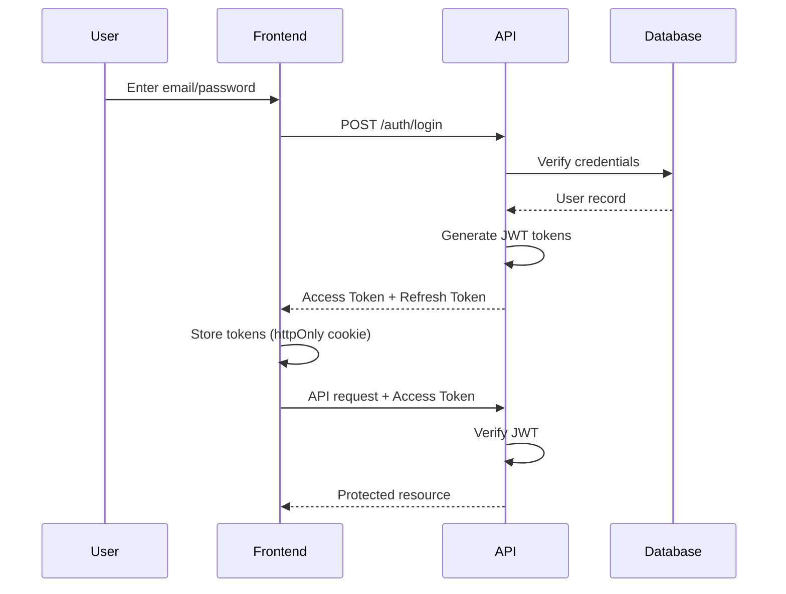

# Security Policy

**Project:** TalentFlow AI
**Last Updated:** 2026-02-01
**Security Level:** High (Handles PII data - CVs, personal information)

---

## 🔒 Overview

TalentFlow AI handles sensitive Personally Identifiable Information (PII), including candidate CVs, contact information, and interview feedback. This document outlines security policies and practices.

---

## 🛡️ Security Principles

1. **Defense in Depth**: Multiple layers of security
2. **Least Privilege**: Users/services have minimum necessary permissions
3. **Secure by Default**: Secure configurations out of the box
4. **Fail Securely**: Errors don't expose sensitive data
5. **Zero Trust**: Verify everything, trust nothing

---

## 🔐 Authentication & Authorization

### Authentication Flow



### JWT Strategy

**Access Token:**
- **Lifetime**: 15 minutes
- **Storage**: httpOnly cookie (not localStorage - XSS protection)
- **Claims**: `userId`, `email`, `role`, `exp`
- **Algorithm**: HS256 (HMAC SHA-256)

**Refresh Token:**
- **Lifetime**: 7 days
- **Storage**: httpOnly cookie, secure flag
- **Rotation**: New refresh token issued on each use
- **Revocation**: Stored in database, can be invalidated

### Password Policy

**Requirements:**
- Minimum 8 characters
- At least 1 uppercase letter
- At least 1 lowercase letter
- At least 1 number
- At least 1 special character (!@#$%^&*)

**Hashing:**
- Algorithm: **bcrypt**
- Cost factor: 10 (2^10 iterations)
- Never store plaintext passwords

**Example:**
```typescript
import * as bcrypt from 'bcrypt';

const saltRounds = 10;
const hashedPassword = await bcrypt.hash(plainPassword, saltRounds);

// Verification
const isMatch = await bcrypt.compare(plainPassword, hashedPassword);
```

### Role-Based Access Control (RBAC)

**Roles:**
- **ADMIN**: Full system access
- **RECRUITER**: Manage jobs, candidates, applications
- **INTERVIEWER**: View assigned candidates, submit feedback

**Permission Matrix:**

| Resource | ADMIN | RECRUITER | INTERVIEWER |
|----------|-------|-----------|-------------|
| **Users** |  |  |  |
| - Create | ✅ | ❌ | ❌ |
| - Read All | ✅ | ❌ | ❌ |
| - Update All | ✅ | ❌ | ❌ |
| - Delete | ✅ | ❌ | ❌ |
| **Jobs** |  |  |  |
| - Create | ✅ | ✅ | ❌ |
| - Read All | ✅ | ✅ | ✅ |
| - Update Own | ✅ | ✅ | ❌ |
| - Delete Own | ✅ | ✅ | ❌ |
| **Candidates** |  |  |  |
| - Create | ✅ | ✅ | ❌ |
| - Read All | ✅ | ✅ | ✅ (assigned only) |
| - Update | ✅ | ✅ | ❌ |
| - Delete | ✅ | ✅ | ❌ |
| **Applications** |  |  |  |
| - Create | ✅ | ✅ | ❌ |
| - Read All | ✅ | ✅ | ✅ (assigned only) |
| - Update Stage | ✅ | ✅ | ❌ |
| **Interviews** |  |  |  |
| - Schedule | ✅ | ✅ | ❌ |
| - Submit Feedback | ✅ | ✅ | ✅ |

---

## 🌐 API Security

### CORS Policy

**Development:**
```typescript
{
  origin: 'http://localhost:3001',
  credentials: true
}
```

**Production:**
```typescript
{
  origin: ['https://app.talentflow.ai', 'https://www.talentflow.ai'],
  credentials: true
}
```

### CSRF Protection

**Strategy:** Double Submit Cookie
- Access token in httpOnly cookie
- CSRF token in request header: `X-CSRF-Token`

**Implementation:**
```typescript
@UseGuards(CsrfGuard)
@Post('jobs')
createJob(@Body() dto: CreateJobDto) {
  // Protected against CSRF attacks
}
```

### Rate Limiting

**Limits:**
| User Type | Rate Limit |
|-----------|------------|
| **Anonymous** | 10 requests / minute |
| **Authenticated** | 100 requests / minute |
| **Admin** | 1000 requests / minute |

**Implementation:**
```typescript
@UseGuards(JwtAuthGuard, RateLimitGuard)
@Controller('jobs')
export class JobController {
  // Rate limited endpoints
}
```

**DDoS Protection:**
- Railway/Vercel built-in DDoS protection
- Cloudflare (optional) for additional layer

### Request Validation

**All inputs validated:**
```typescript
import { IsString, IsEmail, MinLength } from 'class-validator';

export class SignupDto {
  @IsEmail()
  email: string;

  @IsString()
  @MinLength(8)
  password: string;
}
```

**Prevent:**
- SQL Injection (Prisma parameterized queries)
- NoSQL Injection (Prisma type-safe)
- XSS (Input sanitization, Content-Security-Policy)
- Command Injection (No shell commands from user input)

---

## 📁 File Upload Security

### CV Upload Endpoint

**Restrictions:**
- **Allowed MIME types**: `application/pdf`, `application/vnd.openxmlformats-officedocument.wordprocessingml.document` (DOCX)
- **Max file size**: 10 MB
- **Filename sanitization**: Remove special characters, generate UUID

**Virus Scanning:**
- **Phase 1 (MVP)**: Basic file type validation
- **Phase 2**: Integrate ClamAV or cloud service (AWS GuardDuty, VirusTotal)

**Implementation:**
```typescript
@Post('upload')
@UseInterceptors(FileInterceptor('file', {
  limits: { fileSize: 10 * 1024 * 1024 }, // 10MB
  fileFilter: (req, file, cb) => {
    const allowedMimes = ['application/pdf', 'application/vnd.openxmlformats-officedocument.wordprocessingml.document'];
    if (allowedMimes.includes(file.mimetype)) {
      cb(null, true);
    } else {
      cb(new BadRequestException('Invalid file type'), false);
    }
  },
}))
async uploadCV(@UploadedFile() file: Express.Multer.File) {
  // Sanitize filename
  const sanitizedFilename = `${uuidv4()}.${file.originalname.split('.').pop()}`;

  // Upload to Cloudflare R2 with virus scan (Phase 2)
}
```

### Storage Security

**Cloudflare R2 Configuration:**
- **Private buckets**: No public access by default
- **Signed URLs**: Temporary access (1 hour expiry) via presigned URLs
- **Encryption at rest**: AES-256
- **Encryption in transit**: HTTPS only

**Example:**
```typescript
const signedUrl = await r2Client.getSignedUrl({
  Bucket: 'talentflow-cvs',
  Key: fileKey,
  Expires: 3600, // 1 hour
});
```

---

## 🔒 Data Protection (GDPR Compliance)

### PII Data Handling

**PII Fields:**
- Candidate: `email`, `fullName`, `phone`, `linkedinUrl`, `resumeText`
- User: `email`, `fullName`

**Requirements:**
1. **Consent**: Candidates consent to data processing when applying
2. **Access**: Candidates can request their data (API endpoint)
3. **Deletion**: Candidates can request deletion (soft delete, 30-day retention)
4. **Portability**: Candidates can export their data (JSON format)

### Right to be Forgotten

**Implementation:**
```typescript
@Delete('candidates/:id/gdpr')
async deleteCandidate(@Param('id') id: string) {
  // Soft delete (set deletedAt timestamp)
  await this.prisma.candidate.update({
    where: { id },
    data: { deletedAt: new Date() },
  });

  // Hard delete after 30 days (GDPR grace period)
  // Scheduled job handles this
}
```

### Data Retention Policy

| Data Type | Retention Period |
|-----------|------------------|
| **Active Applications** | Until closed + 2 years |
| **Closed Applications** | 2 years after close |
| **Audit Logs** | 7 years (compliance) |
| **Soft-Deleted Candidates** | 30 days, then hard delete |

### Encryption

**At Rest:**
- Database: PostgreSQL with encryption at rest (Railway/Neon default)
- File Storage: Cloudflare R2 server-side encryption (default enabled)
- Sensitive env vars: Railway/Vercel encrypted secrets

**In Transit:**
- HTTPS only (TLS 1.3)
- WebSocket: WSS (secure)
- Database: SSL/TLS connection

---

## 🚨 Security Incident Response

### Incident Types

1. **Data Breach**: Unauthorized access to PII
2. **DDoS Attack**: Service unavailable
3. **Malicious File Upload**: Virus/malware detected
4. **Credential Compromise**: Leaked API keys, passwords

### Response Plan

**Step 1: Detection**
- Monitor logs for suspicious activity
- Alerts from Sentry, Railway

**Step 2: Containment**
- Revoke compromised credentials immediately
- Block malicious IPs (Cloudflare)
- Disable affected accounts

**Step 3: Investigation**
- Analyze logs (request IDs, timestamps)
- Identify scope of breach

**Step 4: Remediation**
- Patch vulnerability
- Reset all affected user passwords
- Notify affected users (GDPR requirement: within 72 hours)

**Step 5: Post-Mortem**
- Document incident
- Update security practices
- Conduct team training

### Security Contact

**Email**: security@talentflow.ai
**On-Call**: [Insert PagerDuty or phone number]

---

## 📋 Security Checklist (Pre-Deployment)

### Authentication & Authorization
- [ ] JWT_SECRET is strong and unique (not default)
- [ ] Password hashing uses bcrypt with cost factor 10+
- [ ] RBAC guards applied to all protected routes
- [ ] Refresh token rotation implemented
- [ ] Session invalidation on logout

### API Security
- [ ] CORS configured correctly (no wildcards in production)
- [ ] CSRF protection enabled for state-changing requests
- [ ] Rate limiting configured and tested
- [ ] All inputs validated with class-validator
- [ ] Error messages don't leak sensitive info

### Data Protection
- [ ] PII fields identified and encrypted
- [ ] GDPR consent collected from candidates
- [ ] Right to be forgotten implemented
- [ ] Data export functionality available
- [ ] Audit logs capture all data access

### File Upload
- [ ] File type validation (whitelist only)
- [ ] File size limits enforced (10 MB max)
- [ ] Filenames sanitized
- [ ] Virus scanning enabled (Phase 2)
- [ ] R2 buckets are private (no public access)

### Infrastructure
- [ ] HTTPS enforced (redirect HTTP to HTTPS)
- [ ] Database connections use SSL/TLS
- [ ] Environment variables secured (Railway/Vercel secrets)
- [ ] Dependencies scanned for vulnerabilities (npm audit)
- [ ] Secrets not committed to Git (.env in .gitignore)

### Monitoring
- [ ] Error tracking configured (Sentry)
- [ ] Audit logs enabled for sensitive operations
- [ ] Alerting rules configured (e.g., multiple failed logins)
- [ ] Security incident response plan documented

---

## 🔍 Vulnerability Disclosure

### Reporting Security Issues

**DO NOT** open a public GitHub issue for security vulnerabilities.

**Instead:**
1. Email security@talentflow.ai
2. Include:
   - Description of vulnerability
   - Steps to reproduce
   - Potential impact
3. We will respond within 48 hours
4. We will fix critical issues within 7 days

### Bug Bounty (Future)

Not currently active. May launch bug bounty program in Phase 2.

---

## 📚 Security Resources

### Training
- [OWASP Top 10](https://owasp.org/www-project-top-ten/)
- [OWASP API Security Top 10](https://owasp.org/www-project-api-security/)
- [GDPR Compliance Guide](https://gdpr.eu/)

### Tools
- **npm audit**: Check for vulnerable dependencies
- **Snyk**: Continuous security monitoring
- **Dependabot**: Automated dependency updates
- **OWASP ZAP**: Security testing

### Regular Tasks
- [ ] **Weekly**: Review access logs for anomalies
- [ ] **Monthly**: Update dependencies (npm audit fix)
- [ ] **Quarterly**: Penetration testing (manual or tool)
- [ ] **Annually**: Security audit (external consultant)

---

## 🎓 Team Security Training

### Required Reading
1. OWASP Top 10 (2 hours)
2. NestJS Security Best Practices (1 hour)
3. This document (30 minutes)

### Secure Coding Practices
- Never commit secrets to Git
- Always validate user input
- Use parameterized queries (Prisma handles this)
- Sanitize output to prevent XSS
- Log security events (failed logins, permission denied)

---

**Last Updated:** 2026-02-01
**Next Review:** 2026-05-01 (Quarterly)
