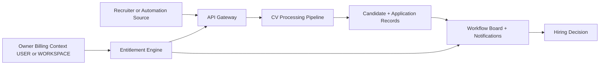

# Product Requirements Document - TalentFlow AI

**Author:** VuongNguyen  
**Date:** 2026-04-17  
**Version:** 3.0 (Standalone BMAD)  
**Status:** Draft

## Executive Summary

TalentFlow AI is a B2B applicant tracking system that reduces recruiter workload by automating candidate intake, profile extraction, fit scoring, and workflow execution.

The product solves three core problems:

- Manual CV triage and data entry are slow and repetitive.
- Keyword-only matching misses qualified candidates when wording differs.
- Hiring workflow execution is fragmented across separate tools.

TalentFlow AI serves Recruiters, Hiring Managers, and Admins through a unified ATS core with expansion paths for enterprise collaboration, automation ingestion, subscriptions, and entitlement control.

### What Makes This Special

- AI-assisted semantic triage turns CV intake into structured decision support.
- Event-driven workflow execution keeps processing, notifications, and audit state aligned.
- Owner-aware billing and entitlement support both personal and workspace operating models.

## Project Classification

- **Project Type:** SaaS B2B
- **Domain:** General
- **Complexity:** Low
- **Project Context:** Brownfield
- **Product posture:** enterprise workflow platform with personal and workspace ownership

## Product & Architecture Context

### Operating Model Summary

| Area                          | Policy                                                                                                                          |
| ----------------------------- | ------------------------------------------------------------------------------------------------------------------------------- |
| Owner contexts                | `USER` and `WORKSPACE` are first-class ownership contexts for subscription and entitlement evaluation                           |
| Plan eligibility matrix       | `USER` can subscribe only to personal tiers; `WORKSPACE` can subscribe only to business tiers                                   |
| USER → WORKSPACE migration    | When ownership upgrades to `WORKSPACE`, subscription state auto-migrates with prorated credit from remaining `USER` entitlement |
| Ingestion conflict resolution | If multiple rules match, resolve by highest `priority`; if tied, choose the most specific pattern                               |
| Refund/chargeback effect      | Verified refund/chargeback starts a grace window, then revokes entitlement if unresolved                                        |
| NLP search release scope      | Natural-language candidate search remains in Growth scope for the next release cycle                                            |

Current platform baseline:

- API Gateway handles auth, job/application APIs, file intake, and event publishing.
- CV Parser handles CV parsing, OCR, and AI scoring.
- Notification Service handles email and real-time updates.
- PostgreSQL stores operational data.
- Object storage stores CV files.
- Async events connect intake, processing, and notification flows.

Expansion baseline:

- Subscriptions and packages for personal and workspace owners.
- Payment lifecycle management with verified callbacks.
- Entitlement and quota gating by owner context and plan.
- Gmail + n8n ingestion through a protected API boundary.

## Success Criteria

### User Success

- Recruiters complete intake and stage movement without manual re-entry.
- Hiring managers review one consolidated candidate view.

### Business Success

- The platform supports automation-driven throughput and planned monetization.
- Paid-plan capabilities are enforced consistently across owners and members.

### Technical Success

- Processing remains reliable, measurable, and secure under async workflows.
- Authorization, audit logging, and idempotency hold across protected operations.

### Measurable Outcomes

| ID    | Success Criterion                                                 | Target                                                                                                                     |
| ----- | ----------------------------------------------------------------- | -------------------------------------------------------------------------------------------------------------------------- |
| SC-01 | Reduce manual CV intake effort per candidate                      | ≥ 50% reduction from current 5-10 minute baseline                                                                          |
| SC-02 | Improve extraction quality for core profile fields                | ≥ 85% extraction accuracy for name/email/phone/skills/experience                                                           |
| SC-03 | Keep AI-assisted triage within the p95 latency target             | Parse + match completes in < 10 seconds (p95)                                                                              |
| SC-04 | Centralize recruitment workflow execution                         | 100% stage transitions occur inside system workflow board                                                                  |
| SC-05 | Execute communication automation reliably                         | For 100% configured stage transitions, the system attempts automated communication and records delivery status             |
| SC-06 | Support reliable external CV automation intake                    | Each valid ingestion request resolves to exactly one idempotent outcome state (created or duplicate-marked)                |
| SC-07 | Enforce paid-plan capability boundaries correctly                 | 100% gated actions evaluate entitlement policy before execution                                                            |
| SC-08 | Preserve subscription lifecycle state integrity                   | 100% activation, migration, refund, and chargeback transitions are tied to verified transaction events and policy outcomes |
| SC-09 | Ensure governed and secure platform access                        | 100% protected ATS actions require authenticated and role-authorized access                                                |
| SC-10 | Enable natural-language candidate retrieval with ranked relevance | Search responses return ranked top-N candidates with confidence/relevance score per query                                  |

## Product Scope

### MVP Scope (In Scope)

1. **Identity & Access Foundations**
   - Email/password authentication.
   - Role-based authorization for core ATS operations.

2. **Job Management**
   - Create, edit, open, and close job descriptions.
   - Configure per-job recruitment workflow stages.

3. **Smart CV Pipeline**
   - CV upload (PDF/DOCX) and profile extraction.
   - AI scoring and candidate-to-JD matching.
   - Screening output with keywords, strengths, and gaps.

4. **Candidate Management**
   - Kanban stage management.
   - Centralized candidate profile timeline (history, notes, attachments).

5. **Automation & Communication**
   - Event-driven candidate processing flow.
   - Automated status-transition emails.
   - Real-time recruiter-facing updates.

### Growth Scope (Next)

1. **Search & Matching Expansion**
   - Natural-language candidate search with ranked results.
   - This capability remains in Growth scope for the next release cycle.

2. **Automation Ingestion Expansion**
   - Protected ingestion endpoint for Gmail + n8n automation.
   - Subject-pattern-to-job mapping.
   - Conflict resolution uses highest `priority`; if tied, the most specific pattern wins.
   - Duplicate detection and idempotent ingestion tracking.

3. **Monetization Expansion**
   - Plan catalog and owner-based subscription lifecycle.
   - `USER` owner context supports personal tiers only; `WORKSPACE` owner context supports business tiers only.
   - USER → WORKSPACE migration auto-transfers subscription state with prorated credit from remaining USER entitlement.
   - Payment transaction lifecycle, callback reconciliation, and post-settlement lifecycle handling (including refund/chargeback) are policy-driven and auditable.

4. **Enterprise Collaboration Expansion**
   - Workspace and member collaboration model.
   - Shared quota pools for business plans.

5. **Entitlement Expansion**
   - Plan-based feature gating and usage quota enforcement.
   - Verified refund/chargeback starts a grace window before entitlement revocation.
   - UTC-based quota reset with presentation-layer timezone display.

### Vision Scope (Long-Term)

- Proactive candidate rediscovery and role-fit recommendations across talent pool history.
- Predictive funnel intelligence for hiring throughput and quality risk.
- Unified policy layer for product, billing, security, and operations governance.

## User Journeys

### UJ-01: Recruiter Creates a Job Pipeline

1. Recruiter creates a job description.
2. Recruiter configures role-specific stages.
3. Job opens for candidate intake.

**Outcome:** Role-specific pipeline is operational.

### UJ-02: Recruiter Uploads CV and Reviews AI Triage

1. Recruiter uploads CV.
2. System validates intake and starts processing.
3. System provides extracted profile, fit score, and screening summary.
4. Recruiter confirms profile and advances stage.

**Outcome:** Candidate triage is standardized and repeatable.

### UJ-03: Recruiter Moves Candidate and Triggers Communication

1. Recruiter moves candidate through workflow stages.
2. System records transition audit.
3. System sends configured notification and updates dashboard state.

**Outcome:** Workflow state and communication remain synchronized.

### UJ-04: Hiring Manager Evaluates Candidate in One View

1. Hiring Manager opens candidate dossier.
2. Hiring Manager reviews score, summary, timeline, and attachments.
3. Hiring Manager records decision input.

**Outcome:** Decision is made with consolidated context.

### UJ-05: Admin Governs Security and Operations

1. Admin manages roles and access policies.
2. Admin monitors operational events and process health.

**Outcome:** ATS operations stay controlled and auditable.

### UJ-06: Automation Source Submits CV Intake

1. Authorized automation source submits ingestion request.
2. System resolves matching rules by highest `priority`; if tied, it selects the most specific pattern.
3. System creates or links candidate/application with idempotent handling.
4. System emits CV processing event for pipeline continuation.

**Outcome:** External automation increases throughput with deterministic rule resolution and without bypassing business rules.

### UJ-07: Owner Purchases and Activates a Plan

1. Owner selects an eligible plan for the owner context (`USER` personal tiers, `WORKSPACE` business tiers).
2. If ownership upgrades from `USER` to `WORKSPACE`, system auto-migrates subscription state with prorated credit from remaining USER entitlement.
3. System creates pending checkout and payment transaction.
4. System verifies callback result and updates transaction.
5. System activates subscription on verified success, or starts a grace window and revokes entitlement for verified refund/chargeback outcomes.

**Outcome:** Monetization flow is deterministic, traceable, and state-safe across activation, migration, and post-settlement events.

### UJ-08: Business Workspace Member Uses Shared Capabilities

1. Member performs gated action (e.g., AI evaluation).
2. System evaluates workspace entitlement policy and member eligibility within business-tier limits.
3. System consumes applicable quota or rejects with policy error.

**Outcome:** Owner-context plan rules are enforced consistently across member actions.

## Domain Requirements

| ID    | Domain Requirement              | Acceptance Target                                                                                                                                                               |
| ----- | ------------------------------- | ------------------------------------------------------------------------------------------------------------------------------------------------------------------------------- |
| DR-01 | Candidate PII protection        | Encryption in transit and at rest is enforced for candidate data paths                                                                                                          |
| DR-02 | Role-restricted data access     | Protected ATS actions are accessible only to authorized roles                                                                                                                   |
| DR-03 | Operational auditability        | Stage transitions, ingestion events, and payment/subscription state changes are logged with actor and timestamp                                                                 |
| DR-04 | Boundary validation discipline  | External inputs (file intake, automation requests, callbacks) are validated before business processing                                                                          |
| DR-05 | Automation security boundary    | External automation cannot write database or queue directly and must use protected API contracts                                                                                |
| DR-06 | Idempotent event handling       | Ingestion retries and payment callback retries do not produce duplicate state transitions                                                                                       |
| DR-07 | Owner-context entitlement model | Subscription eligibility and entitlement are resolved by (ownerType, ownerId), with USER limited to personal tiers and WORKSPACE limited to business tiers                      |
| DR-08 | ATS ownership boundary clarity  | Job ownership remains user-domain centric while workspace governs collaboration and business entitlements, including USER → WORKSPACE migration continuity with prorated credit |

## Innovation Analysis

### Baseline ATS Limitations

- Heavy dependence on manual CV review.
- Weak relevance when matching depends on keyword overlap.
- Poor operational coherence when workflow and communication are split.

### TalentFlow AI Differentiators

1. **AI-Assisted Semantic Triage**
   - Scoring and summary generation improve signal quality at intake.

2. **Event-Driven Workflow Execution**
   - Processing, notifications, and state changes remain synchronized via workflow events.

3. **Automation + Governance Expansion Path**
   - External intake automation, entitlement enforcement, and owner-aware billing support enterprise growth without breaking core ATS boundaries.

## Project-Type Requirements

| ID     | Requirement                                | Acceptance Target                                                                                                                                                |
| ------ | ------------------------------------------ | ---------------------------------------------------------------------------------------------------------------------------------------------------------------- |
| PTR-01 | Multi-role ATS operation                   | Recruiter, Hiring Manager/Interviewer, and Admin responsibilities are enforceable by policy                                                                      |
| PTR-02 | Polyglot event-driven product operation    | Core candidate processing and notification flows operate through asynchronous event contracts                                                                    |
| PTR-03 | Structured intake and lifecycle tracking   | Candidate intake requests and resulting workflow states are traceable end-to-end                                                                                 |
| PTR-04 | Human-in-the-loop controls                 | Recruiters can review and correct extracted candidate data before downstream decisions                                                                           |
| PTR-05 | Owner-context collaboration model          | Product supports personal and workspace operating contexts with explicit eligibility boundaries and without collapsing domain boundaries                         |
| PTR-06 | Monetization and entitlement compatibility | Plan lifecycle and entitlement checks (activation, migration, and refund/chargeback outcomes) integrate with ATS operations without manual operator intervention |

## Functional Requirements

### Identity & Access

- **FR-01** Users can authenticate with email/password credentials — valid users can obtain and refresh authenticated session access for protected APIs.
- **FR-02** System can enforce role-based authorization for ATS actions — protected actions are allowed or denied according to role policy with explicit error responses.

### Job Management

- **FR-03** Users can create, edit, open, and close job descriptions — job lifecycle changes persist and are visible in job listing/detail views.
- **FR-04** Recruiters can configure stage workflows per job — candidate transitions are validated against configured stage rules with clear rejection for invalid transitions.

### Smart CV Pipeline

- **FR-05** Recruiters can upload candidate CV files in PDF/DOCX formats — supported files are accepted; unsupported type/size is rejected with validation feedback.
- **FR-06** System can trigger asynchronous CV processing after accepted intake — each accepted CV intake creates one traceable processing request event with candidate/application context.
- **FR-07** System can extract candidate core profile data from CVs — name, email, phone, skills, and experience fields are available for recruiter review.
- **FR-08** System can evaluate candidate-job fit and explain score basis — candidate receives score (0-100), percentile band, and top matching factors for the selected job.
- **FR-09** System can provide AI screening summary for recruiter decision support — summary includes highlighted JD-matched keywords, strengths, and potential gaps.

### Candidate Management

- **FR-10** Recruiters can move candidates on workflow board with audit continuity — each successful stage transition is persisted with actor and timestamp and reflected in workflow board state.
- **FR-11** Candidate profile can centralize timeline context — authorized users can view interactions, notes, and attachments in one candidate profile.

### Automation & Communication

- **FR-12** System can automate communication on stage transitions — for every configured transition event, the system attempts communication and logs delivery outcome.
- **FR-13** System can provide real-time pipeline status updates — subscribed dashboard channels receive status updates for processing and stage-change events, and the system records emission timestamps for verification.

### Search & Retrieval

- **FR-14** System can search candidates using natural-language intent — search returns ranked top-N candidates with confidence/relevance score and optional job-context filtering; this capability is scheduled for Growth scope in the next release cycle.

### Automation Ingestion

- **FR-15** System can accept authorized external automation ingestion requests — authorized ingestion requests map to job rules using priority-first then specificity tie-break resolution and continue into standard ATS pipeline.
- **FR-16** System can perform idempotent ingestion handling — duplicate ingestion attempts are detected and marked without creating duplicate candidate/application side effects.

### Subscription Lifecycle

- **FR-17** Owners can start and track subscription lifecycle in owner context — USER is limited to personal tiers, WORKSPACE is limited to business tiers, and USER → WORKSPACE upgrades auto-migrate subscription state with prorated credit.
- **FR-18** System can track payment transaction lifecycle and callback outcomes — payment transitions are recorded, activation occurs only after verified success, and verified refund/chargeback outcomes start a grace window before entitlement revocation.

### Entitlement & Quotas

- **FR-19** System can enforce entitlement and quota policy on gated actions — gated actions evaluate current plan/quota and return deterministic policy result (allow/deny).
- **FR-20** Business plans can support workspace membership collaboration limits — workspace plans enforce member eligibility and a maximum of 50 active members per workspace for collaborative usage.

## Traceability Matrix (SC → UJ → FR/NFR)

| Success Criterion | Covered User Journeys | Supporting Requirements           |
| ----------------- | --------------------- | --------------------------------- |
| SC-01             | UJ-02, UJ-06          | FR-05, FR-06, FR-07, FR-09, FR-15 |
| SC-02             | UJ-02                 | FR-07, NFR-01                     |
| SC-03             | UJ-02                 | FR-06, FR-08, FR-09, NFR-02       |
| SC-04             | UJ-01, UJ-03, UJ-04   | FR-03, FR-04, FR-10, FR-11, FR-13 |
| SC-05             | UJ-03                 | FR-12                             |
| SC-06             | UJ-06                 | FR-15, FR-16, NFR-06              |
| SC-07             | UJ-08                 | FR-19, FR-20, NFR-08              |
| SC-08             | UJ-07                 | FR-17, FR-18, NFR-07              |
| SC-09             | UJ-05                 | FR-01, FR-02, NFR-04              |
| SC-10             | UJ-04                 | FR-14                             |

## Non-Functional Requirements

### Performance

- **NFR-01** CV extraction accuracy — at least 85% on a validation dataset for core profile fields, verified against a labeled validation set.
- **NFR-02** CV parse and match latency — less than 10 seconds per CV at p95, verified via pipeline timing in load tests.

### Security

- **NFR-03** Candidate data security — encryption at rest and in transit is enforced for 100% of candidate data paths, verified by pre-release configuration checks and periodic encryption posture audits.
- **NFR-04** Authorization enforcement integrity — 100% of protected ATS endpoints require authenticated and authorized access, verified by CI integration tests on protected routes.
- **NFR-07** Payment lifecycle authenticity — 100% of payment callbacks and settlement-change events (including refund/chargeback) are signature-verified before transaction/subscription updates, verified by callback verification logs and reconciliation reports.

### Audit & Reliability

- **NFR-05** Audit logging completeness — 100% of workflow transitions, ingestion outcomes, and payment/subscription transitions are logged, verified by event-to-audit reconciliation checks.
- **NFR-06** Idempotent retry safety — 100% of duplicate retries for ingestion/callback flows are handled without duplicate state mutation, verified by CI idempotency tests and duplicate-rate monitoring.

### Entitlement & Billing Consistency

- **NFR-08** Entitlement policy consistency — quota reset windows and refund/chargeback grace-window expirations execute on UTC boundaries for 100% of applicable counters and states, verified by daily rollover checks, grace-expiry logs, and post-transition validation.

## Out of Scope

- Payroll, offer administration, and post-hire HRIS operations.
- Direct third-party automation writes to internal database or queue layers.
- Automatic final hiring decisions without human approval.
- Replacing the existing ATS core with a new monolith.

## Decision Log

- **DL-01 — USER → WORKSPACE migration policy:** Auto-migrate subscription state on ownership upgrade, with prorated credit from remaining USER entitlement.
- **DL-02 — Plan eligibility matrix:** USER is limited to personal tiers; WORKSPACE is limited to business tiers.
- **DL-03 — Ingestion rule conflict resolution:** Resolve by highest `priority`; if tied, select the most specific subject pattern.
- **DL-04 — Refund/chargeback entitlement behavior:** Verified refund/chargeback starts a grace window, then revokes entitlement if unresolved.
- **DL-05 — Natural-language search scope:** Keep NL candidate search in Growth scope for the next release cycle.
